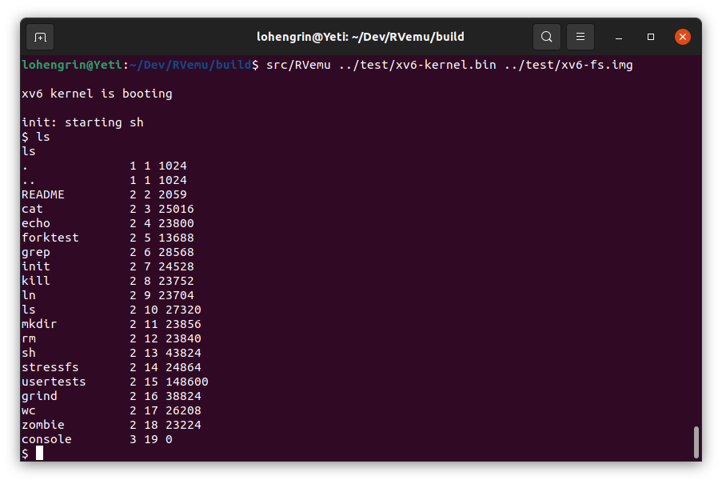
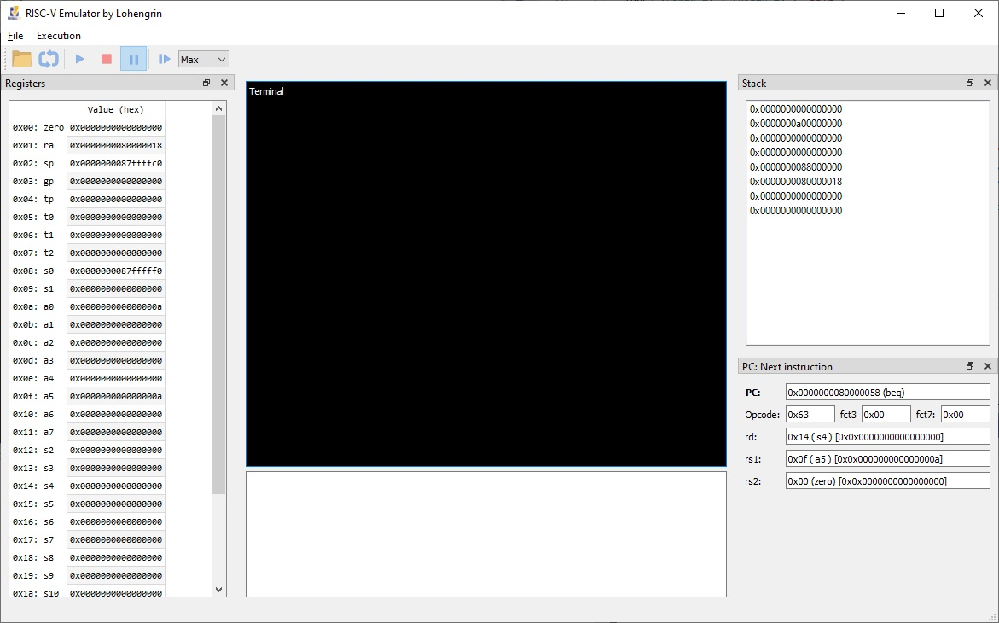

# RVemu
A "Simple" RISC-V Emulator written in C++

Based on https://book.rvemu.app/index.html

Succed to start xv6 kernel and file system.
May still have some bugs

Build with CMake (tested VisualStudio 2019 and Linux GCC).
GUI Version use QT5.

Optionnal Debugging GUI in QT5 (Not yet finished):

